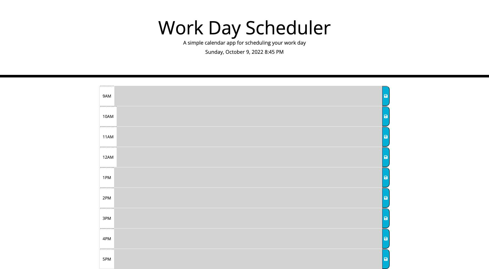

# WORK Day Scheduler

## Description

Work Day Scheduler website is to help user keep track of events or task happening each hour of the day. This website will show you the day and color code the time blocks. Time block in grey are events/tasks in the past, red represent present, and green represent upcoming or future events/tasks.

## Installation

N/A

## Link

https://realkevinc.github.io/workDayScheduler/

## Usage

On the Work Day Scheduler website user will click on the textbox and type down any event/task happen at that specific hour. User will then click on the save icon. This will then save it to it's local storage and when it refresh the text will presist. 

## Credits

Kevin

## License

Please refer to the LICENSE in the repo.